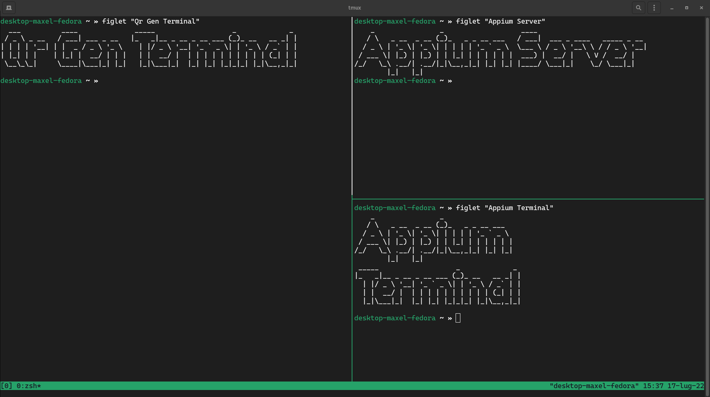

# Test-bench Installer

## Linux (Debian)

> This version has been tested only with Debian 10 and 11.

1. Move inside `scripts/debian-installer`
2. Execute `./pyhton-installer.sh`
3. Execute `./appium-installer.sh`
4. (OPTIONAL) Execute `./bash-variables-installer.sh`; this will add ANDROID_HOME to bashrc and a global folder in `~/.npm-global`.

## Windows

Windows is supported by Appium and TK (for QR Gen), but we do not provide documentation for the installation at the moment.
You should proceed with the classic installation of QRCodeFuzzer and QRCodeGenerator via npm and python/pip respectively.

## MacOS / Linux (General)

We do not provide documentation at the moment, but you should be free to find corresponding packages by looking at the shell scripts installation commands.
You should proceed with the classic installation of QRCodeFuzzer and QRCodeGenerator via npm and python/pip respectively.

# Test-bench Setup & Execution

To replicate the testbench, you need a PC with a monitor and a smartphone.
In order to have everything under control in just one screen, we recommend to use `tmux`.

## Script-assisted

### Single Execution

1. Move inside `script/fuzzqr-single`
2. Open a terminal and configure `tmux` (or open multiple terminals) as shown in the image above (3 terminals).
3. In the left terminal, execute `./qrgen-terminal.sh -p left -a <app_name> -s <optional:start_position>`.
4. Position the smartphone so that the QR Code is fully framed by the camera.
5. In the top right terminal, execute `adb devices` and take note of `device ID`.
6. In the top right terminal, execute `appium` and take note of port.
7. In the bottom right terminal, execute `./appium-terminal.sh -p <appium_port> -d <device_id> -a <app_name> -s <optional:start_position>`

If something fails (e.g. xpath / object ID changes in the app), you will receive a prompt from the bottom right terminal to put the app in the scan page and then press any key to continue.

> Tests are saved inside `fuzzqr/QRCodeFuzzer/data-tests/<app_name>`

### Parallel Execution

1. Move inside `script/fuzzqr-single`
2. Open a terminal and configure `tmux` (or open multiple terminals) as shown in the image above (4 terminals).
3. In the top left terminal, execute `./qrgen-terminal.sh -p left -a <app_name> -s <optional:start_position>`.
4. In the top right terminal, execute `./qrgen-terminal.sh -p right -a <app_name> -s <optional:start_position>`.
5. Position the smartphones so that the QR Code is fully framed by the cameras (one on the left, one on the right).
6. In the bottom left (or right) terminal, execute `adb devices` and take note of `device ID` of both smartphones.
7. In another workspace, or in a background window, open two new terminals and execute `appium -p <port_number>`.
8. In the bottom left terminal, execute `./appium-terminal.sh -p <appium_port_1> -d <device_id_1> -a <app_name> -s <optional:start_position>`
9. In the bottom right terminal, execute `./appium-terminal.sh -p <appium_port_2> -d <device_id_2> -a <app_name> -s <optional:start_position>`

If something fails (e.g. xpath / object ID changes in the app), you will receive a prompt from the bottom terminals to put the app in the scan page and then press any key to continue.

> Tests are saved inside `fuzzqr/QRCodeFuzzer/data-tests/<app_name>`

### Sequential Execution (experimental)

Sequential execution can be useful to execute multiple applications tests.
The setup is similar to single / parallel execution, with the only constraint that you can pass a `<app_lists_file>` instead of `<app_name>`.

Here's an example with parallel execution (single execution is straight forward):

1. Move inside `script/fuzzqr-sequential`, and create two files `apps-phone-1.txt` and `apps-phone-2.txt`, each containing list of apps to test in new lines.
2. Open a terminal and configure `tmux` (or open multiple terminals) as shown in the image above (4 terminals).
3. In the top left terminal, execute `./qrgen-terminal.sh -p left -f <app_lists_file_1> -s <optional:start_position>`.
4. In the top right terminal, execute `./qrgen-terminal.sh -p right -f <app_lists_file_2> -s <optional:start_position>`.
5. Position the smartphones so that the QR Code is fully framed by the cameras (one on the left, one on the right).
6. In the bottom left (or right) terminal, execute `adb devices` and take note of `device ID` of both smartphones.
7. In another workspace, or in a background window, open two new terminals and execute `appium -p <port_number>`.
8. In the bottom left terminal, execute `./appium-terminal.sh -p <appium_port_1> -d <device_id_1> -f <app_lists_file_1> -s <optional:start_position>`
9. In the bottom right terminal, execute `./appium-terminal.sh -p <appium_port_2> -d <device_id_2> -f <app_lists_file_2> -s <optional:start_position>`

## Manual

### Single Execution

> Get with `adb devices` the `udid` of the devices to use as "device name".

1. Start `appium -p 4723` in terminal (even in background)
2. Start a bash script with `python main.py -a <app> -j <json_data_path> -p <left/right/center> -sf <optional:start_position>` in another terminal
3. Start a bash script with `node index.js <app> <data_path> <port> <device_name> <optional:start_position>` in a third terminal

### Parallel Execution

> Get with `adb devices` the `udid` of the devices to use as "device name".

1. Start `appium -p 4723` in terminal A (even in background)
2. Start `appium -p 4724` in terminal B (even in background)
3. Start a bash script with `python main.py -a <app> -j <json_path>` for terminal 1
4. Start a bash script with `python main.py -a <app> -j <json_path>` for terminal 2
5. Start a bash script with `node index.js <app> <data_path> <port> <device_name>` for terminal 3 (same path as terminal 1)
6. Start a bash script with `node index.js <app> <data_path> <port> <device_name>` for terminal 4 (same path as terminal 2)
